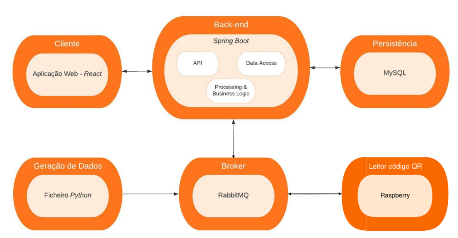

# Vaccination Desk

Sistema de agendamento de vacinação, distribuição de vacinas e verificação de administração de vacinas.

## Sobre o Projeto
O sistema tem como objetivo realizar a gestão de todo o processo relacionado com a administração de vacinas. Permite também o agendamento automático de vacinas, a sua distribuição por diferentes centros de vacinação, podendo esta ser feita por grupo prioritários e a verificação da presença de utentes a levar a vacina num determinado centro de vacinação. 

Para marcar uma vacina, o utilizador insere no sistema os seus dados, ficando assim numa lista de espera a aguardar que receba uma notificação via e-mail, com as informações relativas ao agendamento da sua vacina, mais propiamente, qual o centro que lhe foi atribuido, e a data acompanhada do horário da mesma. Mais tarde, à chegada ao centro de vacinação, o utente terá de validar o código QR que lhe foi enviado no email. Caso seja válido, poderá levar a vacina. 

A distribuição de vacinas pelos centros de vacinação pode ser feita automaticamente pelo sistema (i.e. a distribuição é feita de acordo com a ordem de marcação no sistema), ou ser feita de acordo com critérios de prioridade definidos pelo gerente.

O gerente do sistema monitoriza as vacinas e gere os centros de vacinação.

> Todos os dados supramencionados são gerados automaticamente pelo sistema, não sendo reais.

## Arquitetura

>#### Componentes
>A arquitetura do sistema está dividida em 5 grupos principais:
>- **Geração de dados:** onde através de um script em Python, serão gerados dados relativamente à inscrição de utentes para a vacinação, chegada de vacinas e quantidades das mesmas.
>- **Broker:** irá receber as informações da geração de dados, e irá mandá-las para a parte do back-end onde estas serão processadas e guardadas (RabbitMQ).
>- **Back-end:** Terá acesso à base de dados e terá comunicações com a parte do cliente e do broker, será aqui que os principais processamentos serão feitos (Spring Boot - Rest API, Broker e BD).
>- **Client:** A aplicação web, será desenvolvida com base no template em JS React, sendo depois adaptado às necessidades quer de visualização quer de comunicação com o back-end.
>- **Persistence:** A base de dados (MySQL) do sistema é do tipo relacional sendo bastante importante guardar de forma segura todos os dados que o sistema gera.

## Backlog

- Para o backlog foi usado o o *Github Projects*  ....

## Como executar

1. correr os conteiners docker. Na raiz do projeto corra o comando  
    docker-compose up  
**Nota:** leia o tópico **DevOps** ao final desse ficheiro.  
2. correr o backend. no diretório projService/vaccinationdeskservice/ corra o comando:  
    mvn spring-boot:run  
3. correr o frontend. no diretório projFrontend/ corra os comandos:  
    npm install  
    npm run start  
4. correr os scripts python.  
no diretório projDataGen/ corra os comandos:  
    source venv/bin/activate  
    python3 generator.py  
no diretório projService/vaccinationdeskservice corra o comando:  
    python3 requests_API.py  
    

## Deploy

O deploy foi feito na VM fornecida.  
* O frontend pode ser acessado pelo endereço http://deti-engsoft-18.ua.pt:3000/
* O backend (Springboot) está a correr em background na porta 8081.  
* Existem 2 scripts pyhon a correr em beckgrond para geração de dados.  
* A database (mySQL) esta a correr em um docker container e pode ser acessada na porta 3306
* O broker (rabbitMQ) esta a correr em um docker container e pode ser acessado na porta 15672
  
**OBS:** Configuramos o nginx para servir o frontend na porta 80 da VM, entretanto os arquivos html staticos gerados pelo next.js não estão a funcionar bem. Portanto existe uma versão do frontend a rodar na porta 80, servida pelo nginx com o funcionamento das paginas html incorredo, paraa efeitos de avaliação do frontend utilize o link http://deti-engsoft-18.ua.pt:3000/  

## Relatório

O projeto está acompanhado de um relatório, sendo que o mesmo pode ser consultado [aqui](reports/IES%20Project%20Specification%20Report.pdf).

Em progresso: https://docs.google.com/document/d/16WMrNr4wjFYltof8mGiAAXVExDsUrgvn6NY8cXZja3s/edit?usp=sharing

## Equipa
| NMEC | NOME| Papel |
|----:|-----|-----|
| 98323 | [Raquel da Silva Ferreira](https://github.com/Raqsf) | Team Manager, Developer |
| 98546 | [Patrícia Matias Dias](https://github.com/Patricia-Dias)) | Product Owner, Developer |
| 91359 | [Juan Victor Lessa Gonçalves](https://github.com/juanlessa) | DevOps Master, Developer |
| 98491 | [Pedro Alexandre Coelho Sobral](https://github.com/TheScorpoi) | Architect, Developer |

## DevOps
### Docker-compose
Na raiz do projeto basta correr o comando.  
    docker-compose up   
Para interromper o docker compose basta correr o comando.  
    docker-compose down  
### mySQL
Na primeira execução deve tambem criar as tabelas na base de dados.  
Basta se conectar a db, por exemplo usando a extensão "mysql' do vs code e correr o script .sql de criação das dbs.
db connection:
            MYSQL_ROOT_PASSWORD: password  
            MYSQL_DATABASE: vaccinationdb  
            MYSQL_USER: ies  
            MYSQL_PASSWORD: password  
### rabbitMQ
Certifique-se de que o exist o user "prod" no rabbitmq.  
1. acessar http://deti-engsoft-18.ua.pt:15672/ ou http://localhost:15672/ e fazer login:  
user: myuser  
password: mypassword  
2. ir para a tab "admin"  
3. adicionar o user "prod" caso não exista:  
user: prod  
password: prod  
